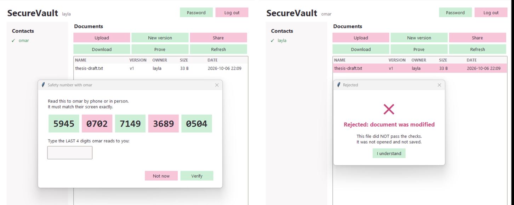
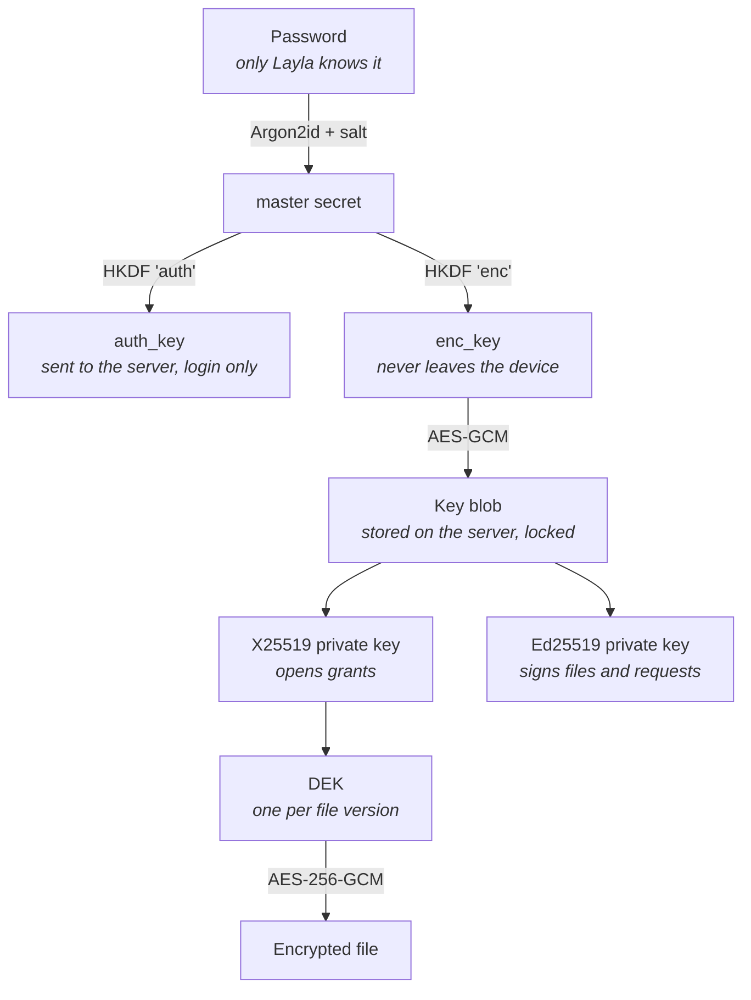
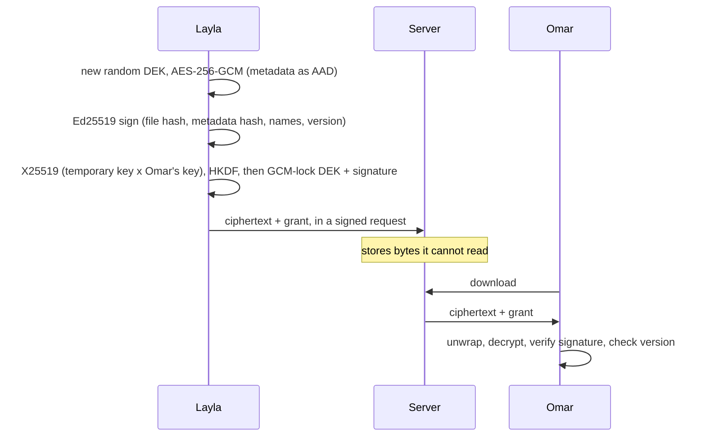
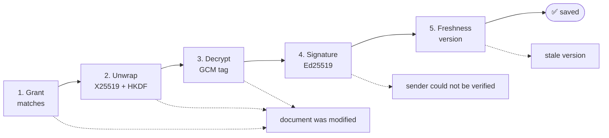

<div align="center">

# 🔐 SecureVault

**Encrypted document sharing on a server you don't trust.**

[](https://github.com/Holmes-99/SecureVault/actions/workflows/tests.yml)


[](LICENSE)

[Demo video](https://drive.google.com/file/d/1FTbIxETZ7RjuhxpHSZO8-puomnyNXUFB/view) · [Design report](report/SecureVault_Report.pdf) · [Design decisions](docs/DESIGN.md) · [Slides](slides/SecureVault.pdf)

</div>

Our final project for ENCS4320 (Applied Cryptography) at Birzeit University.

Layla wants to share her thesis with Omar through a server neither of them trusts. SecureVault makes that safe: the server stores every byte but can't read any of them, and Omar's client checks the content, the metadata, the sender and the version of every file before it opens it. An attacker who controls the network can flip bytes, rename files, replay old versions and swap keys, and every one of those attempts is caught.

> [!WARNING]
> **Educational project. Do not use it to protect real data.**
> We implemented SHA-256/512, HMAC, HKDF, AES, GCM, X25519 and Ed25519 ourselves to learn how they work. The code passes the official test vectors, but it has not been audited, is not constant-time, and is far slower than production libraries. For real systems, use a vetted library such as `cryptography` or libsodium.

## Contents

- [Highlights](#highlights)
- [Demo](#demo)
- [How it works](#how-it-works)
- [Security properties](#security-properties)
- [Getting started](#getting-started)
- [Running the system](#running-the-system)
- [Demo walkthrough](#demo-walkthrough)
- [Project structure](#project-structure)
- [Limitations](#limitations)
- [Team](#team)

## Highlights

- **All cryptography on the client.** The server only stores and relays opaque bytes.
- **Cryptography written from scratch**: SHA-256/512, HMAC, HKDF, AES-256, GCM, X25519 and Ed25519, tested against official NIST/RFC vectors and a reference library. Only Argon2id comes from a library.
- **No passwords on the server.** Argon2id at 384 MiB, a salt per user, and a login challenge answered with HMAC.
- **Proof of origin.** Every file is signed with Ed25519, and a third party can check the signature with no account and no server.
- **Key trust without a CA.** Keys are pinned on first use and confirmed with a 20-digit safety number.
- **A real attacker in the loop.** A proxy sits on the network and tampers with traffic live during the demo.
- **236 tests**, run on every push.

## Demo

▶️ **[Watch the demo video](https://drive.google.com/file/d/1FTbIxETZ7RjuhxpHSZO8-puomnyNXUFB/view)**: sign-up, sharing, and the attacker's flip, rename, replay and key swap getting rejected.

The graphical client. Left: Layla compares the safety number with Omar and has to type the last group she hears before she can verify him. Right: Omar's download is refused after the attacker flipped one byte, and the dialog can't be dismissed for three seconds.



## How it works


### Key hierarchy

Each layer only unlocks the one below it. Changing the password re-locks the 92-byte key blob and nothing else.



### Sharing a file

The file is encrypted once. Sharing with someone new only adds a small grant for them.



### Opening a file

Omar's client runs five checks in a fixed order. Nothing is shown or saved until all of them pass.



## Security properties

| Property | How SecureVault provides it |
|---|---|
| 🔒 Confidentiality | AES-256-GCM with a fresh DEK per version; the DEK reaches Omar wrapped with X25519 + HKDF |
| 🧩 Integrity | GCM tag over the content and the metadata, checked before any plaintext is used |
| ✍️ Data origin | Ed25519 signature checked with the sender's pinned key |
| ⚖️ Non-repudiation | The same signature, which anyone can verify (`prove` + `tools/verify_proof.py`) |
| 🔑 Credential protection | Argon2id (384 MiB, 3 passes) with a 16-byte salt per user; only `auth_key` is stored |
| ⏱️ Freshness | Login challenge, signed timestamp + nonce on every request, signed version numbers |
| 🏷️ Metadata binding | Metadata is the GCM AAD, and its hash is inside the signature |

### Primitives

| Primitive | Used for | Checked against |
|---|---|---|
| SHA-256 | file and metadata hashes, safety number | FIPS 180-4 |
| SHA-512 | inside Ed25519 | FIPS 180-4 |
| HMAC-SHA256 | login challenge, fake salt for unknown users | Python's `hmac` |
| HKDF | `auth_key` / `enc_key`, grant wrap keys | RFC 5869 |
| AES-256 + GCM | files, grants and the key blob | FIPS 197, SP 800-38D |
| X25519 | delivering the DEK to the recipient | RFC 7748 |
| Ed25519 | signing files and requests | RFC 8032 |
| Argon2id | password stretching (from `argon2-cffi`) | RFC 9106 |

Every primitive is also cross-checked against the `cryptography` library (or `hashlib`) on random inputs. The `cryptography` package is only used in the tests and the benchmark, never by the system itself.

## Getting started

You need Python 3.12 or newer.

**Windows (PowerShell)**

```powershell
py -m venv .venv
.\.venv\Scripts\Activate.ps1
pip install -r requirements.txt
```

**macOS / Linux**

```bash
python3 -m venv .venv
source .venv/bin/activate
pip install -r requirements.txt
```

### Tests

```bash
python -m pytest tests
```

The full run takes about 2.5 minutes, mostly because of one SHA-256 test on a 10 MB input. To skip it:

```bash
python -m pytest tests -k "not large_input"
```

## Running the system

Each program runs in its own terminal, in this order:

| # | Program | Command | Notes |
|---|---|---|---|
| 1 | Server | `python server/server.py` | port 5050 |
| 2 | Attacker | `python attacks/attacker.py` | demo only, port 5051 |
| 3 | Layla | `python client/gui.py --port 5051 --side left` | or `client/client.py` for the terminal |
| 4 | Omar | `python client/gui.py --port 5051 --side right` | |

`--port 5051` sends the clients through the attacker. `--side` places the two GUI windows next to each other.

<details>
<summary><b>Terminal client commands</b></summary>

| Command | What it does |
|---|---|
| `signup <user>` / `login <user>` / `logout` | account |
| `passwd` | change your password |
| `contact <user>` | save their keys and show the safety number |
| `verify <user>` | after you compared the safety number |
| `upload <file>` / `update <doc> <file>` | new file / new version |
| `list` | your documents |
| `share <doc> <user>` | only works for verified contacts |
| `download <doc>` | checks everything, then saves the file |
| `prove <doc>` | saves a proof of who sent it |

For `<doc>` you can type just the first few characters of the id that `list` shows.

</details>

<details>
<summary><b>Attacker commands</b></summary>

| Command | Effect |
|---|---|
| `mode pass` | forward everything untouched |
| `mode flip` | flip one byte of every downloaded file |
| `mode rename` | change the file name in the metadata (asks for the new name) |
| `mode replay` | answer with an older copy it recorded earlier |
| `mode swapkey` | hand out the attacker's public keys instead |
| `resend` | send the last captured signed request again |

</details>

## Demo walkthrough

Real output from the attacker proxy and the recipient's client:


| # | What we show | How | Result |
|---|---|---|---|
| 1 | Two users sign up | `signup layla`, `signup omar` | ✅ |
| 2 | The server has no passwords | `python tools/show_server_data.py` | only salts, `auth_key`s and locked key blobs |
| 3 | Stored files are unreadable | Layla uploads, then run the viewer again | ciphertext only |
| 4 | Sharing | both `contact` + compare + `verify`; Layla shares; Omar downloads | ✅ `signed by layla` |
| 5 | Proof for a third party | `prove <doc>`, then `python tools/verify_proof.py <proof> <file>` | `VALID` |
| 6 | One byte changed | attacker `mode flip`, Omar downloads | ❌ `document was modified` |
| 7 | Metadata changed | attacker `mode rename`, Omar downloads | ❌ `document was modified` |
| 8 | Old copy replayed | Omar downloads v1; Layla uploads v2 and shares; attacker `mode replay` | ❌ `stale version` |
| 9 | Primitives are correct | `python -m pytest tests` | ✅ 236 passed |
| + | Fake key (MITM) | attacker `mode swapkey` before `contact` | safety numbers differ |
| + | Replayed request | attacker `resend` | ❌ `Request rejected` |
| + | Weakened build | `python attacks/weakened_build.py` | the attacks work on the broken copy and fail on ours |

Put the attacker back on `mode pass` between steps.

### Other scripts

| Script | What it shows |
|---|---|
| `tools/bench_password_hash.py` | how we picked the Argon2id memory cost |
| `tools/bench_ecc_vs_rsa.py` | Curve25519 vs RSA-3072 at the same security level |
| `tools/crack_estimate.py` | how long an offline attack on a stolen database would take |

## Project structure

```text
SecureVault/
├── client/
│   ├── crypto/          our primitives: SHA-256/512, HMAC, HKDF, AES, GCM, X25519, Ed25519, safety number
│   ├── keys.py          key hierarchy, key blob, password change
│   ├── secure_share.py  encrypt, sign, grant, and the five download checks
│   ├── client.py        terminal client
│   └── gui.py           graphical client
├── server/              the server (stores opaque bytes, checks signed requests)
├── shared/              byte formats and protocol messages
├── attacks/             network attacker and weakened build (only for our own system)
├── tools/               benchmarks, data viewer, proof checker
├── tests/               236 tests
├── docs/                DESIGN.md and the images in this README
├── report/              the design report (PDF)
├── slides/              the presentation (PDF)
└── experiments/         our first try at a password KDF, not used anymore
```

### Secrets

Nothing secret is in the repo. Everything is created locally when you run the programs, and `.gitignore` keeps it out of git:

| Folder | Made by | Holds |
|---|---|---|
| `server_data/` | the server | users, encrypted files, a random `server_secret.bin` |
| `client_data/<user>/` | the client | keys you saved for other users, last version seen of each file |
| `downloads/` | the client | files you downloaded (decrypted) |

Private keys are never saved in plain form. They're stored on the server, locked with a key that comes from your password, and only unlocked in memory after you log in.

## Limitations

We list these honestly; the full discussion is in the [report](report/SecureVault_Report.pdf).

- A password from a common word list still falls in about 30 minutes; a strength check at sign-up would help.
- The safety number only protects users who actually compare it.
- A stolen database gives the attacker `auth_key`, which passes login but can't read files or sign anything. A signature-based login would remove it.
- The recipient's X25519 key is long-lived, so there is no forward secrecy for stored files. Key rotation with re-wrapping would fix that.
- The pure-Python code is not constant-time, and GCM runs at about 105 KiB/s.
- The server still sees file names, sizes, times and who shares with whom.

## Team

| Name | GitHub |
|---|---|
| Shatha Abualrub | [@Holmes-99](https://github.com/Holmes-99) |
| Lara Daifallah | [@LaraDaifallah](https://github.com/LaraDaifallah) |
| Razan Shalabi | [@Razan-Shalabi](https://github.com/Razan-Shalabi) |

## License

Released under the [MIT License](LICENSE). See the warning at the top: this code is for learning, not for protecting real data.
