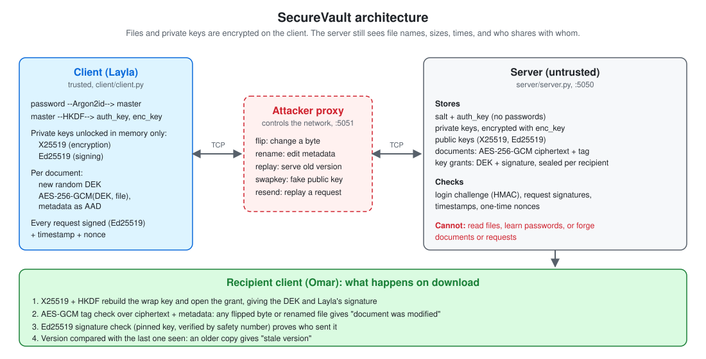
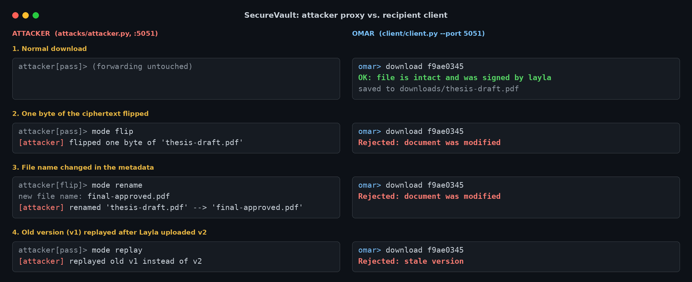

# SecureVault

[](https://github.com/Holmes-99/SecureVault/actions/workflows/tests.yml)
[](LICENSE)

Our final project for ENCS4320 (Applied Cryptography) at Birzeit University.

SecureVault lets users upload documents to a server they don't trust and share them with each other. The server stores everything but can't read any of it, and the client checks every file it gets back (content, metadata, sender and version) before opening it.

> [!WARNING]
> **Educational project. Do not use it to protect real data.**
> We implemented SHA-256/512, HMAC, HKDF, AES, GCM, X25519 and Ed25519 ourselves to learn how they work. The code passes the official test vectors, but it has not been audited, is not constant-time, and is far slower than production libraries. For real systems, use a vetted library such as `cryptography` or libsodium.



## Team

| Name | GitHub |
|---|---|
| Shatha Abualrub | [@Holmes-99](https://github.com/Holmes-99) |
| Lara Daifallah | [@LaraDaifallah](https://github.com/LaraDaifallah) |
| Razan Shalabi | [@Razan-Shalabi](https://github.com/Razan-Shalabi) |

## Setup

You need Python 3.12 or newer. From the project folder:

Windows (PowerShell):

```powershell
py -m venv .venv
.\.venv\Scripts\Activate.ps1
pip install -r requirements.txt
```

macOS / Linux:

```bash
python3 -m venv .venv
source .venv/bin/activate
pip install -r requirements.txt
```

## Tests

```powershell
python -m pytest tests
```

The full run takes around 2.5 minutes, mostly because of one SHA-256 test on a 10 MB input. To skip it:

```powershell
python -m pytest tests -k "not large_input"
```

We test every primitive against the official test vectors (NIST, RFC 5869, 7748, 8032, 9106) and also compare it with the `cryptography` library on random inputs.

## Running it

Each program goes in its own terminal:

| What | Command | Notes |
|---|---|---|
| server | `python server/server.py` | start this first (port 5050) |
| client | `python client/client.py` | one per user |
| GUI client | `python client/gui.py` | same as the client, with windows |
| attacker | `python attacks/attacker.py` | demo only, sits on port 5051 |

To go through the attacker, start the clients with `--port 5051`.

Client commands (type `help` to see them):

| Command | What it does |
|---|---|
| `signup <user>` / `login <user>` / `logout` | account |
| `passwd` | change your password |
| `contact <user>` | save their keys and show the safety number |
| `verify <user>` | after you compared the safety number |
| `upload <file>` / `update <doc> <file>` | new file / new version |
| `list` | your documents |
| `share <doc> <user>` | only works for verified contacts |
| `download <doc>` | checks everything, then saves the file |
| `prove <doc>` | saves a proof of who sent it |

For `<doc>` you can type just the first few characters of the id that `list` shows.

Attacker commands: `mode pass`, `mode flip`, `mode rename`, `mode replay`, `mode swapkey`, and `resend`.

## Demo steps

Real output from the attacker proxy and the recipient's client while the attacker tampers with a shared file:



| # | What we show | How |
|---|---|---|
| 1 | two users sign up | `signup layla` in one client, `signup omar` in the other |
| 2 | the server has no passwords | `python tools/show_server_data.py` |
| 3 | stored files are unreadable | Layla: `upload thesis-draft.pdf`, then the viewer again |
| 4 | sharing | both: `contact` + compare numbers + `verify`; Layla: `share <doc> omar`; Omar: `download <doc>` |
| 5 | who sent it | the download says "signed by layla"; `prove <doc>`, then `python tools/verify_proof.py <proof> <file>` |
| 6 | a byte is changed | attacker `mode flip`, Omar downloads: `document was modified` |
| 7 | metadata is changed | attacker `mode rename`, Omar downloads: `document was modified` |
| 8 | an old copy is replayed | Omar gets v1 through the attacker; Layla `update` + `share`; Omar gets v2; attacker `mode replay`, Omar downloads: `stale version` |
| 9 | the primitives are correct | `python -m pytest tests` |
| + | fake key (MITM) | attacker `mode swapkey` before `contact`: the safety numbers don't match |
| + | replayed request | attacker `resend`: server says `Request rejected` |

Put the attacker back on `mode pass` between steps.

`python attacks/weakened_build.py` runs a broken version of our encryption (a reused nonce, and no tag check) and shows both being attacked, while our real version rejects them.

## Other scripts

| Script | What it shows |
|---|---|
| `tools/bench_password_hash.py` | how we picked the Argon2id memory cost |
| `tools/bench_ecc_vs_rsa.py` | Curve25519 vs RSA-3072 at the same security level |
| `tools/crack_estimate.py` | how long an offline attack on a stolen database would take |

## What's where

| Folder | Contents |
|---|---|
| `client/crypto/` | our primitives: SHA-256/512, HMAC, HKDF, AES, GCM, X25519, Ed25519, safety number |
| `client/` | keys.py, secure_share.py, client.py, gui.py |
| `server/` | server.py |
| `shared/` | byte formats and protocol messages |
| `attacks/` | attacker and weakened build (only for our own system) |
| `tools/` | benchmarks and helper scripts |
| `tests/` | the tests |
| `docs/` | DESIGN.md (decisions and byte formats), README images |
| `report/` | the report |
| `slides/` | the presentation |
| `experiments/` | our first try at a password KDF, not used anymore |

## Libraries

We wrote all the cryptography the system uses ourselves, except Argon2id, which comes from `argon2-cffi`. Our pure-Python version was far too slow to use a real memory cost (see DESIGN.md). The `cryptography` package is only used in the tests and the benchmark, not by the system itself.

## Secrets

Nothing secret is in the repo. It's all created locally when you run the programs, and `.gitignore` keeps it out of git:

| Folder | Made by | Holds |
|---|---|---|
| `server_data/` | the server | users, encrypted files, a random `server_secret.bin` |
| `client_data/<user>/` | the client | keys you saved for other users, last version seen of each file |
| `downloads/` | the client | files you downloaded (decrypted) |

Private keys are never saved in plain form. They're stored on the server encrypted with a key that comes from your password, and only unlocked in memory after you log in.

## License

Released under the [MIT License](LICENSE). See the warning at the top: this code is for learning, not for protecting real data.
